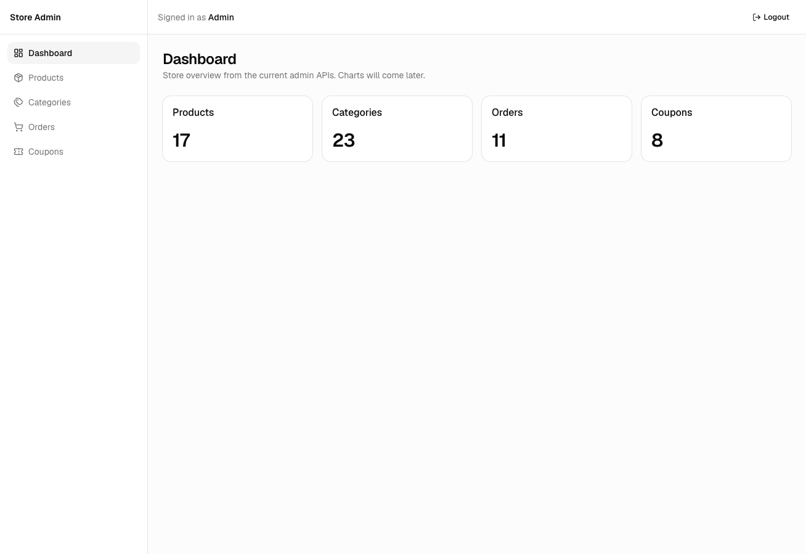
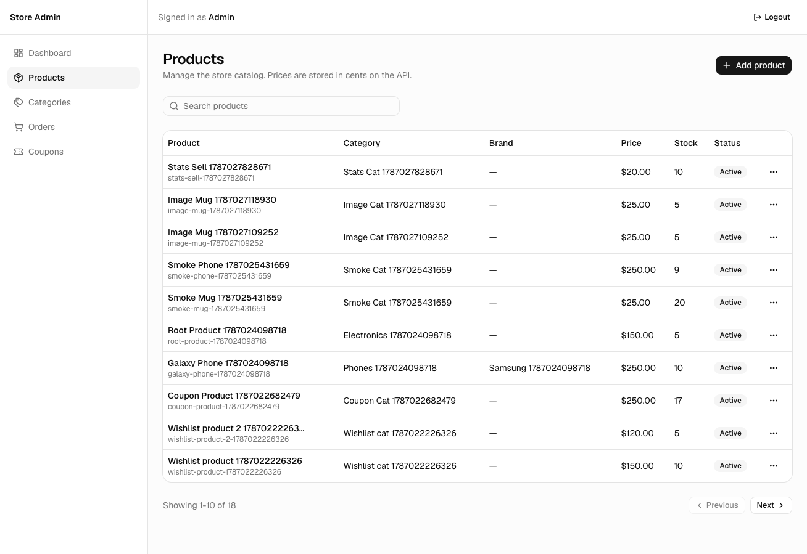
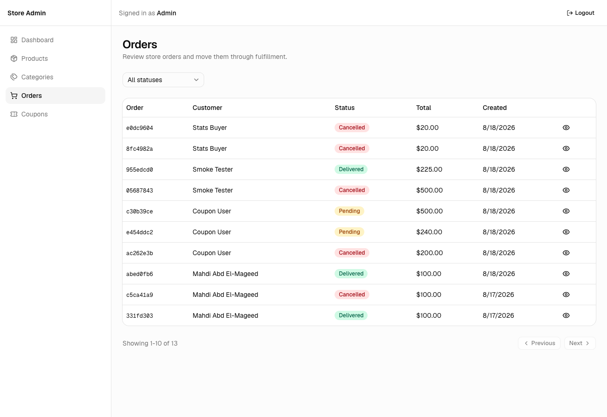
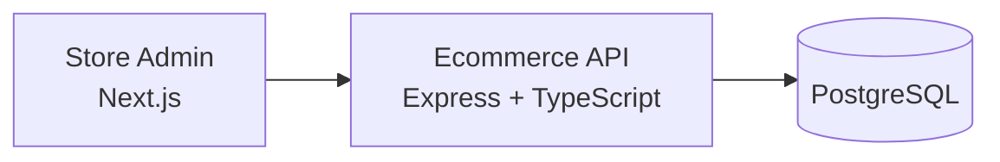

<div align="center">

# Store Admin

### Admin dashboard for a full-stack ecommerce platform

[](https://nextjs.org/)
[](https://react.dev/)
[](https://www.typescriptlang.org/)
[](https://tailwindcss.com/)

[](https://ui.shadcn.com/)
[](https://tanstack.com/query)
[](#-roadmap)

[Companion API](https://github.com/mahdi-code007/ecommerce-api-typescript)

</div>

---

## Overview

Store Admin is the operator dashboard for the ecommerce API. Admins can sign in, review sales analytics, and manage the catalog, categories, orders, and discount codes from a single interface.

It is built as a **feature-based Next.js app**: each domain owns its API calls, queries, forms, and table UI, while shared layout, auth, and HTTP live in `shared/`.

> [!NOTE]
> This dashboard talks to the [ecommerce API](https://github.com/mahdi-code007/ecommerce-api-typescript). Start the API on `http://localhost:8000` before running the dashboard.

## Screenshots

<p align="center">
  
</p>

<p align="center">
  
</p>

<p align="center">
  
</p>

## Features

- **Admin-only access** — JWT login, session restore via `/auth/me`, and a hard block for non-admin accounts
- **Dashboard analytics** — KPI cards, revenue and status charts, top products, low stock, and 7/30/90-day range filters
- **Product catalog** — create, edit, delete, search, and paginate products with category, brand, stock, image, and active status
- **Categories** — root categories and subcategories, with protected deletes when products still belong to them
- **Orders** — filter by status, inspect items and shipping details, and move orders through `pending → confirmed → shipped → delivered`
- **Coupons** — percentage or fixed-amount discounts, with create, update, and delete
- **Validated forms** — React Hook Form + Zod, API errors surfaced as toasts
- **Responsive shell** — sidebar on desktop, sheet navigation on mobile

## Tech stack

| Area | Technology |
| --- | --- |
| Framework | Next.js 16 App Router |
| Language | TypeScript |
| UI | Tailwind CSS 4, shadcn/ui, Lucide |
| Charts | Recharts |
| Data | TanStack Query, axios |
| Tables | TanStack Table |
| Forms | React Hook Form, Zod |
| Auth | JWT stored in the browser, sent as `Bearer` |

## Architecture



```text
app/                 Routes and layouts
features/            Auth, dashboard, products, categories, orders, coupons
shared/              API client, query keys, auth storage, layout, table helpers
components/ui/       shadcn/ui primitives
```

Each feature follows the same shape: `api.ts` → `queries.ts` → page + dialogs. Prices stay in **minor units** on the API and are formatted for display in the UI.

## Getting started

### Prerequisites

- Node.js 20 or newer
- The [ecommerce API](https://github.com/mahdi-code007/ecommerce-api-typescript) running on `http://localhost:8000`

### Installation

```bash
git clone https://github.com/mahdi-code007/ecommerce-admin-dashboard.git
cd ecommerce-admin-dashboard
npm install
cp .env.example .env.local
```

`.env.example` already points at the local API:

```env
NEXT_PUBLIC_API_BASE_URL=http://localhost:8000/api/v1
```

### Run

```bash
npm run dev
```

Open [http://localhost:3001](http://localhost:3001) and sign in with an account whose `role` is `admin`.

New API accounts are created as `user`. Promote one locally, then log in again so the token includes the admin role:

```sql
UPDATE users
SET role = 'admin'
WHERE email = 'you@example.com';
```

## Scripts

| Command | Description |
| --- | --- |
| `npm run dev` | Start the dashboard on port `3001` |
| `npm run build` | Production build |
| `npm run start` | Serve the production build |
| `npm run lint` | Run ESLint |

## Roadmap

- Brand management UI
- Stronger order search and date filters

## Related projects

| Project | Role |
| --- | --- |
| [ecommerce-api-typescript](https://github.com/mahdi-code007/ecommerce-api-typescript) | Backend API this dashboard consumes |
| **ecommerce-admin-dashboard** | This repository |
